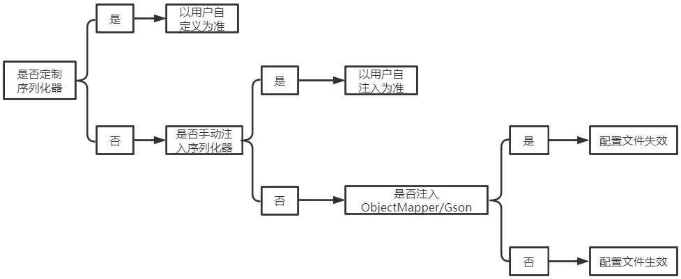

# 序列化

序列化支持

- jackson(默认)
- fastjson
- Gson
- ProtoBuf
- 自定义支持

```note
其中Json相关的序列化方式默认配置了日期格式为`yyyy-MM-dd HH:mm:ss`
```

## 序列化切换

默认使用Jackson序列化，因此Restlight也默认引入了Jackson依赖，如果想要切换成别的序列化方式，则需要引入对应的Maven依赖并进行简单的配置。

Example：以切换Gson为例

1. 引入Gson依赖：

```xml
<dependency>
     <groupId>com.google.code.gson</groupId>
     <artifactId>gson</artifactId>
     <version>2.8.5</version>
</dependency>
```

2. 注入Gson序列化器

```java
@Bean
public HttpBodySerializer bodySerializer() {
    return new GsonHttpBodySerializer();
}
```

完成切换。

```tip
如果不想继续引入默认的Jackson依赖可以使用`<exclusions/>`标签排除， 同时一旦注入了自定义的序列化器原来默认的Jackson序列化器将不会再生效
```

## 序列化器

**接口标准定义**

- `HttpRequestSerializer`： 用于请求的反序列化。
- `HttpResponseSerializer`： 用于响应的序列化。
- `HttpBodySerializer`： 继承自`HttpRequestSerializer`以及`HttpResponseSerializer`, 可同时提供请求与响应的序列化功能。

**内置的序列化器**

- `FastJsonHttpBodySerializer`
- `JacksonHttpBodySerializer`
- `GsonHttpBodySerializer`
- `ProtoBufHttpBodySerializer`

```note
切换时引入Maven依赖并注入对应的序列化器即可
```

## 定制序列化器

可以选择通过继承或者自定义实现`HttpRequestSerializer`以及`HttpResponseSerializer`接口（或者`HttpResponseSerializer`同理）的方式实现定制序列化。

如，在上面的例子中我们切换序列化方式为jackson，此时我们想定制序列化的日期格式为`yyyy-MM-dd`

```java
@Bean
public HttpBodySerializer bodySerializer() {
    ObjectMapper objectMapper = new ObjectMapper();
    objectMapper.setDateFormat(new SimpleDateFormat("yyyy-MM-dd"));
    return new HttpJsonBodySerializerAdapter(new JacksonSerializer(objectMapper)) {};
}
```

同样也可以定制更多的序列化选项。

## 多个序列化器并存

Restlight并不像Spring MVC一样要求一个应用中只能使用一种序列化方式，Restlight允许多种序列化方式并存。

实际的服务中我们可能有这样的需求：我们对接服务A时使用的是ProtoBuf序列化，而其他情况都是使用的fastjson序列化。

配置如下：

```java
@Bean
public HttpBodySerializer fastjsonBodySerializer() {
    return new FastJsonHttpBodySerializer();
 
@Bean
public HttpBodySerializer protoBufBodySerializer() {
    return new ProtoBufHttpBodySerializer();
}
```

直接注入两个序列化器即可。

上面的配置当MediaType（请求对应`ContentType`, 响应对应`Accept`）为`application/json`时使用JSON序列化,  为`application/x-protobuf`时使用ProtoBuf序列化.

## 兼容Spring Boot标准

使用Spring Boot时，经常在配置文件里面添加Jackson和Gson的配置，如：

```properties
spring.jackson.date-format=yyyy-MM-dd HH:mm:ss
spring.gson.date-format=yyyy-MM-dd HH:mm:ss
```

Restlight同样支持该标准，其作用逻辑如下图所示：

如图所示，配置文件中Jackson和Gson相关内容要想生效，需要满足如下条件：
> 1. 用户没有手动定制HttpJsonBodySerializerAdapter
> 2. 用户没有手动注入Jackson或者Gson序列化器(FastJsonHttpBodySerializer和GsonJsonHttpBodySerializer)
> 3. 用户没有手动注入ObjectMapper或者Gson对象
> 4. 配置文件有对Jackson和Gson进行配置

满足以上四个条件，配置文件中关于Jackson和Gson的配置，才会在对应的Jackson和Gson序列化器中生效。

### 响应序列化内容协商(Json与ProtoBuf序列化)

```note
前提： json和ProtoBuf的序列化器已经被正确的配置。
```

当 json和ProtoBuf的序列化器同时存在时， 响应序列化方式可以通过url中的参数来指定。

- 首先开启序列化协商功能：

```pro
# 开启请求序列化协商
restlight.server.serialize.request.negotiation=true
# 开启响应序列化协商
restlight.server.serialize.response.negotiation=true
```

指定使用json序列化

**eg**:  `/foo/{bar}?format=json`

指定使用protobuf序列化

**eg**:  `/foo/{bar}?format=pb`

```note
参数可选值：`json`, `pb`
```

- 当参数`format`与应用自身的某些接口中的参数冲突时可以通过配置修改参数名称

```pro
restlight.server.serialize.request.negotiation-param=your-param-name
restlight.server.serialize.response.negotiation-param=your-param-name
```

```tip
此种方式实际上相当于在请求的`Accept`字段中加入了`application/json`, `application/x-protobuf`值， 因此如果使用了自定义的序列化器，根据`HttpResponseSerializer.supportsWrite(MediaType mediaType, Type type)`方法实现不同可能与实际行为不符。 具体请参考下文`多个序列化器框架如何选择使用哪个序列化器实现`章节。
```

## 使用`@RequestSerializer`指定请求序列化器

当配置了多个序列化器时， 可以使用`@RequestSerializer`中指定使用某个固定的序列化方式

下面的Controller指定使用Jackson反序列化请求数据

```java
@PostMapping("/foo")
public void bar(@RequestBody @RequestSerializer(JacksonHttpBodySerializer.class) User user) {
    // ...
}
```

```tip
`@RequestSerializer`可以在Prameter, Method以及Class上使用， 优先级依次递减。
```

## 使用`@ResponseSerializer`指定响应序列化器

当配置了多个序列化器时， 可以使用`@ResponseSerializer`中指定使用某个固定的序列化方式

下面的Controller指定使用Jackson序列化响应结果

```java
@PostMapping("/foo")
@ResponseSerializer(JacksonHttpBodySerializer.class)
public Foo bar() {
    return new Foo();
}
```

```tip
`@ResponseSerializer`可以在Method以及Class上使用， 优先级依次递减。
```

## 使用`@Serializer`指定请求 & 响应序列化器

当配置了多个序列化器时， 可以使用`@Serializer`中指定使用某个固定的序列化方式， 相当于同时指定`RequestSerializer`以及`@ResponseSerializer`。

下面的Controller指定使用Jackson序列化

```java
@PostMapping("/foo")
@Serializer(JacksonHttpBodySerializer.class)
public Foo bar(@RequestBody User user) {
    return new Foo();
}
```

```tip
`@ResponseSerializer`可以在Method以及Class上使用， 优先级依次递减。
```

## 多个序列化器框架如何选择使用哪个序列化器实现？

序列化器接口`HttpRequestSerializer`， `HttpResponseSerializer`中均定义了`suppot(xxx)`方法， 用于在多个序列化器并存的情况下判断使用哪一个序列化器。以`HttpRequestSerializer`为例

```java
public interface HttpRequestSerializer extends BaseHttpSerializer, RxSerializer {
    
    boolean supportsRead(MediaType mediaType, Type type);
    
}
```

`HttpRequestSerializer`中定义了`supportsRead(MediaType mediaType, Type type)`方法用于判断当前序列化器是否支持此次请求的序列化， 其中参数`MediaType`为请求的`ContentType`， `Type`为当前反序列化的目标类型。

同样`HttpResponseSerializer`

```java
public interface HttpResponseSerializer extends BaseHttpSerializer, TxSerializer {

    boolean supportsWrite(MediaType mediaType, Type type);

    Object customResponse(AsyncRequest request, AsyncResponse response, Object returnValue);

}
```

- `supportsWrite(MediaType mediaType, Type type)`方法用于判断当前序列化器是否支持此次请求的序列化， 其中参数`MediaType`为请求的`Accept`字段中的值， `Type`为当序列化的原始类型。
- `customResponse(xxx)`将会在实际调用序列化之前被调用， 并使用返回值的Object作为此次序列化的原始对象（也就是说允许用户在响应的序列化之前更改响应的对象）


同时， 序列化器实现本身具有优先级由`getOrder()`表示(值越低优先级越高)

当最终无法找到匹配的序列化器时， 会通过默认的优先级进行序列化（暂时仅响应序列化为此行为）。

```java
@Bean
public HttpBodySerializer fastjsonBodySerializer() {
    return new FastJsonHttpBodySerializer() {
       @Override
       public int getOrder() {
           return 0;
       }
   };
 
@Bean
public HttpBodySerializer protoBufBodySerializer() {
    return new ProtoBufHttpBodySerializer() {
        @Override
        public int getOrder() {
            return 1;
        }
    };
}
   
```

## 多种序列化并存时的优先级

- 请求序列化

1. 如果指定了`@RequestSerializer`或者`@Serializer`中指定的序列化方式则使用该序列化方式
2. 使用序列化协商中的参数指定的序列化器
3. 根据`ContentType`查找序列化器
4. 未找到则报错

- 响应序列化

1. 如果指定了`@ResponseSerializer`或者`@Serializer`中指定的序列化方式则使用该序列化方式
2. 使用序列化协商中的参数指定的序列化器
3. 根据`Accept`查找序列化器
4. 根据`RequestMapping`中produces指定的序列化器（未找到进入6）
5. 未找到使用默认优先级最高的序列化器

## ProtoBuf序列化支持

Restlight内置了ProtoBuf序列化器的实现，对应支持的MediaType为`application/x-protobuf`(需要请求的`Content-Type`为`application/x-protobuf`

同时使用ProtoBuf序列化器序列化后的响应结果的`Content-Type`也为`application/x-protobuf`)。

针对ProtoBuf序列化的特点，ProtoBuf序列化后还将增加Header， `X-Protobuf-Schema`和`X-Protobuf-Message`分别返回Message对象的`getDescriptorForType().getFile().getName()`和`getDescriptorForType().getFullName`的结果。


## 特殊类型返回值的序列化

不管Controller上是否加有`@ResponseBody`注解， 在使用序列化器序列化之前都将遵守以下原则

> - 值为String类型直接返回该字符串结果。
> - 值为byte[]类型直接将结果写入响应。
> - 值为ByteBuf类型时直接将结果写入响应
> - 以上均不符合则使用序列化器进行序列化。
> - 如果Controlelr上未配置`@ResponseBody`，值为基本类型或基本类型包装类将返回该类型的字符串结果（调用String.valueOf()）。
> - 以上均不符合则抛异常。
